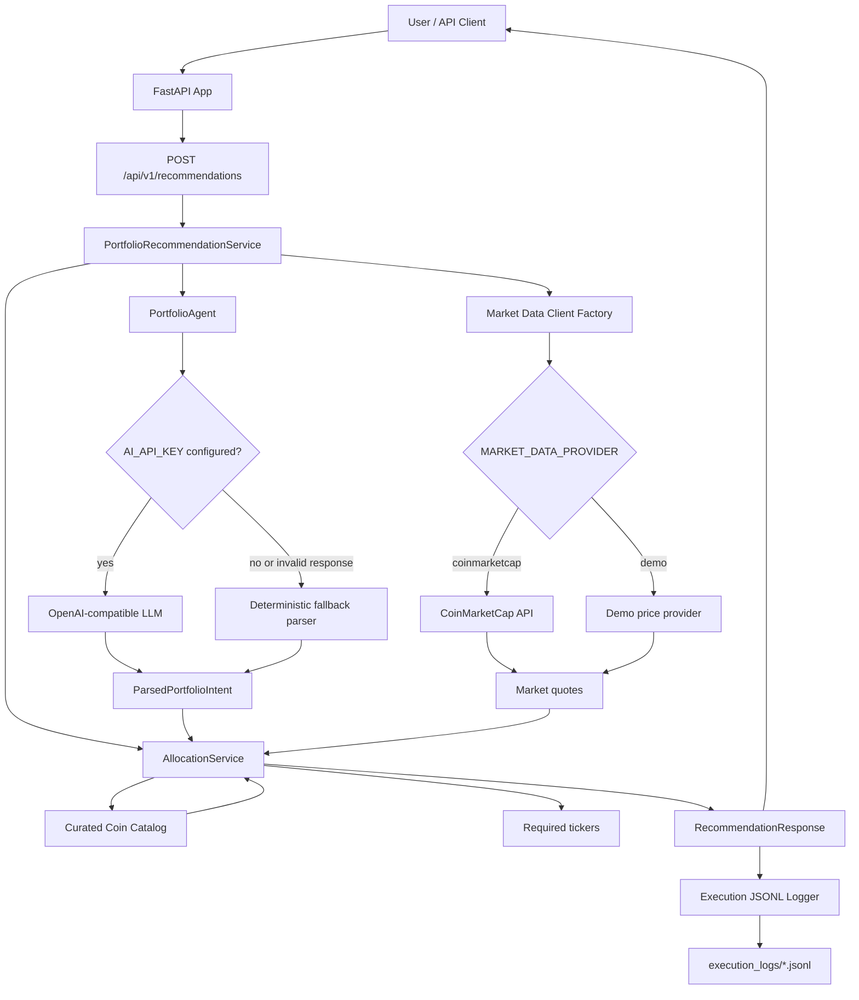

# Crypto Portfolio Agent Challenge

AI-assisted API that builds a basic cryptocurrency portfolio from a natural language request.

The user provides a budget, a risk level, and optional preferences such as preferred coins or exclusions. The backend parses the intent, fetches market prices, selects an appropriate coin set, and returns a 3-5 asset allocation with quantities and short descriptions.

This project was built for the live-coding challenge described in [CHALLENGE.md](./CHALLENGE.md).

## What It Does

- Parses natural language portfolio requests.
- Supports `low`, `medium`, and `high` risk profiles.
- Supports preferred tickers, for example `prefer BTC`.
- Supports excluding meme coins, for example `exclude meme coins`.
- Fetches live prices from CoinMarketCap when configured.
- Falls back to deterministic demo prices when no market API key is configured.
- Uses an OpenAI-compatible model endpoint for AI intent extraction when `AI_API_KEY` is configured.
- Falls back to a deterministic regex parser when no AI key is configured or the AI response is invalid.
- Logs request/response executions as JSONL files in `execution_logs/`.
- Runs with Docker Compose from a clean clone.

## Tech Stack

- Python 3.11
- FastAPI
- Pydantic
- OpenAI Python SDK pointed to an OpenAI-compatible provider
- Groq-compatible default config: `https://api.groq.com/openai/v1`
- CoinMarketCap market data API
- Pytest
- Docker Compose

## Architecture



## Project Structure

```text
app/
  agents/          AI and fallback intent parsing
  api/             FastAPI route definitions
  clients/         Market data clients
  core/            Config, errors, logging, execution recorder
  data/            Curated coin catalog
  schemas/         Pydantic request/response models
  services/        Portfolio orchestration and allocation logic
tests/
  integration/     API-level tests
  unit/            Service, parser, market data, and logging tests
execution_logs/    JSONL execution records
```

## Run With Docker

From the repository root:

```bash
docker compose up --build
```

The API will be available at:

```text
http://localhost:8000
```

Useful URLs:

```text
http://localhost:8000/health
http://localhost:8000/docs
```

The root path `/` is intentionally not implemented, so `http://localhost:8000/` returns `404`.

## Environment Variables

The app has safe defaults. A clean clone can run without API keys using:

- deterministic fallback parsing
- demo market prices

To use real AI and live market data, create `.env` from the example:

```bash
cp .env.example .env
```

Then set:

```bash
AI_API_KEY=your_groq_api_key
MARKET_DATA_PROVIDER=coinmarketcap
MARKET_DATA_API_KEY=your_coinmarketcap_api_key
```

Default AI config:

```bash
AI_PROVIDER=openai_compatible
AI_BASE_URL=https://api.groq.com/openai/v1
AI_MODEL=openai/gpt-oss-20b
```

To get credentials:

- Groq API key: https://console.groq.com/
- CoinMarketCap API key: https://coinmarketcap.com/api/

`.env` is intentionally ignored by Git.

## Example Request

```bash
curl -sS -X POST http://localhost:8000/api/v1/recommendations \
  -H 'Content-Type: application/json' \
  -d '{"message":"I want to invest 1500 USD in medium risk cryptocurrencies. Prefer ETH and SOL, exclude meme coins."}'
```

Example response shape:

```json
{
  "execution_id": "815a2baf-303e-49b0-b11a-07dfb523a0b8",
  "request": {
    "budget_usd": "1500",
    "risk_level": "medium",
    "preferred_tickers": ["ETH", "SOL"],
    "excluded_tickers": [],
    "excluded_categories": ["meme"]
  },
  "summary": "A balanced allocation across established and growth-oriented assets.",
  "allocations": [
    {
      "name": "Ethereum",
      "ticker": "ETH",
      "amount_usd": "437.50",
      "price_usd": "2453.8843189775625",
      "quantity": "0.17828876",
      "description": "Ethereum is a smart contract platform used by decentralized applications."
    }
  ],
  "total_allocated_usd": "1500.00",
  "disclaimer": "This is an educational portfolio suggestion, not financial advice."
}
```

The real response includes 3-5 allocations depending on risk level.

## Run Tests

Using `uv`:

```bash
uv run pytest
```

Current test status:

```text
18 passed
```

## Execution Logs

Each recommendation request is recorded in JSONL format:

```text
execution_logs/executions-YYYY-MM-DD.jsonl
```

The logs include:

- execution id
- timestamp
- route
- status
- request payload
- response payload
- error payload, when applicable

Sensitive fields such as `api_key`, `authorization`, `token`, `secret`, `password`, `ai_api_key`, and `market_data_api_key` are redacted by the logger.

For this challenge, sample execution logs are intentionally committed so reviewers can inspect real request/response behavior.

## Design Decisions

### FastAPI Backend

FastAPI was chosen because the challenge is backend-focused and FastAPI gives a clear contract through request/response schemas, automatic OpenAPI docs, and simple async integration with external APIs.

### Thin Agent Boundary

I kept the agent focused on intent extraction only:

- budget
- risk level
- preferred tickers
- excluded tickers
- excluded categories

The model does not calculate allocations, invent prices, or choose unsupported coins. Those responsibilities stay in deterministic backend code where they are easier to test and reason about.

### OpenAI-Compatible SDK Instead Of A Heavy Agent Framework

I evaluated using Pydantic-AI because it fits typed Python agent workflows. During integration, Groq's `openai/gpt-oss-20b` worked reliably through the OpenAI-compatible chat API, but failed in the Pydantic-AI structured-output/tool-calling path because the model did not consistently call the expected tool.

For this challenge, I chose the simpler and more robust approach:

- call the OpenAI-compatible API directly with the OpenAI SDK
- request JSON output
- validate the model response with Pydantic
- fall back to a deterministic parser if validation fails

This keeps the implementation small and reliable while still using an AI model where it adds value.

### Deterministic Allocation Logic

The allocation algorithm is intentionally deterministic:

- `low` risk returns 3 assets
- `medium` risk returns 4 assets
- `high` risk returns 5 assets
- preferred coins are prioritized when compatible with the selected risk profile
- excluded tickers/categories are removed before selection
- coin weights come from a curated catalog
- the final asset absorbs rounding differences so total allocation equals the requested budget

This avoids asking the LLM to do financial math.

### Curated Coin Catalog

The project uses a small curated catalog instead of dynamically selecting every possible market asset. This keeps the first version explainable and testable. The catalog includes metadata such as:

- CoinMarketCap id
- ticker
- name
- risk profiles
- categories
- default allocation weight
- short description

### Market Data Provider

There are two market data modes:

- `demo`: deterministic prices, useful for local runs without keys
- `coinmarketcap`: live quotes using CoinMarketCap `/v3/cryptocurrency/quotes/latest`

The live client requests quotes by CoinMarketCap id rather than symbol to avoid ambiguity.

### Error Handling

Application-level errors use typed error codes and return controlled HTTP 400 responses where appropriate. Missing budget, missing risk level, unsupported tickers, and market data failures are handled without exposing stack traces to the API consumer.

### Logging

The execution logger writes JSONL records to a local folder mounted into Docker. This is intentionally simple and inspection-friendly for a challenge. In production, I would send structured logs to an external observability platform and use correlation ids across services.

## Trade-Offs

Included:

- backend-first implementation
- AI parsing
- fallback parser
- live market data
- deterministic allocation
- execution logging
- tests
- Docker Compose

Intentionally left out:

- frontend UI
- database persistence
- chat history
- user accounts
- streaming responses
- portfolio rebalancing
- vector database / RAG
- real financial suitability questionnaire

With more time, I would add:

- a minimal frontend for visual testing
- persisted recommendation history
- stronger prompt evaluation tests
- richer validation for contradictory user requests
- market cap and volatility inputs
- provider retry/backoff policy
- CI workflow running tests and lint

## AI Usage During Development

I used AI assistance as a coding partner for:

- comparing framework options for the challenge
- drafting the first architecture plan
- designing the FastAPI folder structure
- implementing tests around allocation, parsing, market data, and logging
- debugging the CoinMarketCap response shape
- debugging model integration with Groq
- drafting this README

One AI-suggested direction I decided not to keep was using Pydantic-AI as the runtime agent framework. It looked attractive for typed structured outputs, but the selected Groq model failed the tool-calling path in practice. I kept the better part of the idea, typed validation, and implemented it directly with Pydantic plus the OpenAI-compatible SDK.

## Limitations

This is not financial advice. The recommendation is educational and simplified.

The risk model is rule-based and uses a small curated catalog. It does not consider a user's full financial situation, time horizon, jurisdiction, liquidity needs, taxes, volatility tolerance, or existing holdings.

Market prices can change quickly. Quantities are calculated from the quote returned at request time.
